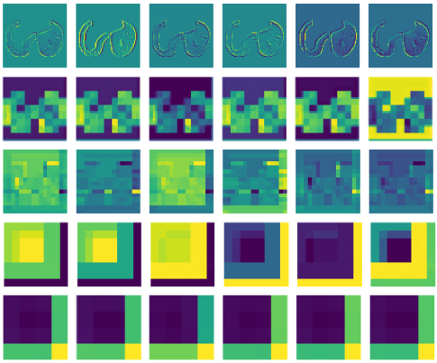
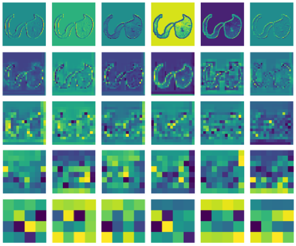

<div align="center">

# MULTI-TASK LEARNING FOR CHEST CT AUTOENCODER


<a href="https://pytorch.org/get-started/locally/"></a>
<a href="https://pytorchlightning.ai/"></a>
<a href="https://hydra.cc/"></a>
<a href="https://github.com/ashleve/lightning-hydra-template"></a><br>

</div>

## Description

Codebase of my thesis

## How to run

Install dependencies

```bash
# clone project
git clone https://github.com/phamgialinhlx/lidc-autoencoder
cd lidc-autoencoder

# [OPTIONAL] create conda environment
conda create -n lung python=3.10 -y
conda activate lung

# install pytorch according to instructions
# https://pytorch.org/get-started/

# install requirements
pip install -r requirements.txt
```

Train model with default configuration

```bash
# train on CPU
python src/train.py trainer=cpu

# train on GPU (default)
python src/train.py
```

You can train a specific experiment by specifying the experiment name in the command line like this:

```bash
# train diffusion model using experiment config
python src/train_diffusion.py experiment=swin_transformer_ae
```

## Experiment results
### Reconstruction performance on different backbone
| Backbone | SSIM | PSNR |
|----------|------|------|
| swin_transformer | 0.9715 | 36.568 |
| cnn-attention | 0.9795 | 37.978 |

### Influence of Pretrained Backbones on Segmentation Performance
| Experiment | Backbone | Pretrained | Dice | Jaccard |
|------------|----------|------------|------|---------|
| UNet++ | cnn-attention | False | 0.7566 | 0.6085 |
| Downstream UNet++ | cnn-attention | True | 0.7664 | 0.6213 |
| SwinUNETR | swin_transformer | False | 0.7780 | 0.6367 |
| Downstream SwinUNETR | swin_transformer | True | 0.7865 | 0.6481 |

### Comparison of different loss functions on Downstream Segmentation Tasks

| Experiment | Loss Function | Dice | Jaccard |
|------------|---------------|------|---------|
| Downstream SwinUNETR | Cross Entropy | 0.7865 | 0.6481 |
| Downstream SwinUNETR | Focal | 0.7664 | 0.6213 |
| Downstream SwinUNETR | Soft Dice | 0.7903 | 0.6533 |

### Assessing the Performance of Different Classification Modules in Downstream Classification Tasks

| Experiment | Pretrained Backbone | Accuracy | Precision | Recall | F1 |
|------------|----------------------|----------|-----------|--------|----|
| ResNet18 | swin-transformer | 0.8441 | 0.9277 | 0.8315 | 0.877 |
| ResNet50 | swin-transformer | 0.9899 | 0.9893 | 0.9957 | 0.9925 |

### Evaluating the Reconstruction Performance of Multihead Approach Compared to Other Methods

| Experiment | SSIM | PSNR |
|------------|------|------|
| rec_baseline | 0.9715 | 36.568 |
| multihead_baseline (seg) | 0.9405 | 25.537 |
| multihead_baseline (cls) | 0.9357 | 25.136 |
| multihead_baseline (cls/seg) | 0.9079 | 22.694 |

### Evaluating the Segmentation Performance of Multihead Approach Compared to Other Methods

| Experiment | Dice | Jaccard |
|------------|------|---------|
| downstream_seg_baseline | 0.7903 | 0.6533 |
| multihead_baseline (seg) (1) | 0.7928 | 0.6568 |
| multihead_baseline (seg) (2) | 0.8206 | 0.6957 |
| multihead_baseline (cls/seg) (1) | 0.6781 | 0.5130 |
| multihead_baseline (cls/seg) (2) | 0.8308 | 0.7105 |


- (1) Segmentation loss factor β = 1.
- (2) Segmentation loss factor β = 25.

<table>
  <tr>
    <td><br><p align="center">Feature maps from downstream segmentation model</p></td>
    <td><br><p align="center">Feature maps from multihead autoencoder model</p></td>
  </tr>
</table>


### Evaluating the Classification Performance of Multihead Approach Compared to Other Methods

| Experiment | Accuracy | Precision | Recall | F1 |
|------------|----------|-----------|--------|----|
| downstream_cls_baseline | 0.9899 | 0.9893 | 0.9957 | 0.9925 |
| multihead_baseline (cls) | 0.9928 | 0.9984 | 0.9905 | 0.9946 |
| multihead_baseline (cls/seg) | 0.9985 | 0.9985 | 0.9842 | 0.9913 |

### Generation performance on different backbone
| Experiment | FID |
|------------|-----|
| swin-transformer | 15.41 |
| cnn-attention | 23.11 |